# TP N°2: React (Primera Parte)

## 🧑‍🤝‍🧑 Integrantes del Grupo 9

| Apellido y Nombres           | Nº de Legajo |
|------------------------------|--------------|
| Antueno, Pablo Sebastián     |   FAI-4973   |
| Cruz, Jesús Ramón Alexis     |   FAI-4682   |
| Mondaca, Araceli Andrea      |   FAI-2147   |

## Explicación de la aplicación

El Gestor de peliculas y series es una herramienta para almacenar información sobre peliculas y series y categorizarlas como "vistas" o "por ver" según cada usuario. Pueden editar la información de cada item o eliminarlo según deseen. Además pueden cambiar el estado de cada item de "por ver" a "vista" y visceversa.

## Instrucciones de instalacion

* Instalar Node.js

Node.js es el entorno de ejecución necesario para correr la app.

npm es el gestor de paquetes para instalar dependencias.

Visita https://nodejs.org/es y sigue las instrucciones para su instalación. Node.js incluye npm

Para verificar que se han instalado correctamente, ejecuta los comandos node -v y npm -v en la terminal. Si te responde algo como "v18.19.1" y "10.2.4", entonces se instalo correctamente.

* Clonar repositorio

Abrir la terminal y ejecutar el comando: git clone https://github.com/psantueno/group9-tp2-react.git

* Entrar a la carpeta creada

En la terminal, ejecutar el comando: cd group9-tp2-react

* Instalar las dependencias 

En la terminal, ejecutar el comando: npm install

* Levantar el servidor

En la terminal, ejecutar el comando: npm run dev o npm start

* Abrir la página en el navegador

En tu navegador, busca la url: http://localhost:5173

## Explicación de los archivos principales

* main.jsx

Es el punto de entrada principal de la aplicación. Se encarga de renderizar el componente principal `<App />` dentro del elemento con id="root" que está en index.html.

* App.jsx

Es el componente principal de la aplicación. Desde acá se estructura el resto de la app. Este componente contiene los demás componentes utilizados en la app.

* index.css

Es el archivo de estilos globales de la aplicación. Los estilos afectan a todos los componentes dentro de `<App />`. Debe importarse dentro del archivo main.jsx.

* package.json

Es el archivo de configuración del proyecto. En el se listan las dependencias de la aplicación, como ejecutarla y su nombre.

## Explicación de los componentes

* Button

Componente de tipo boton utilizado para mostrar/ocultar el formulario de añadir una serie/pelicula, enviar el formulario y limpiar los filtros

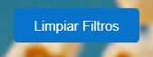

* Counter

Componente que muestra el total de peliculas/series en las listas Vistas y Por ver, con sus respectivos desgloses de cantidad por genero en cada lista.

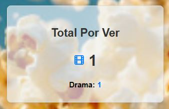
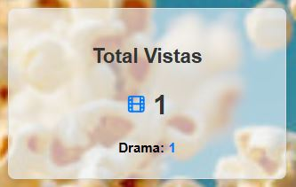

* List

Componente que sirve para estructurar las listas Vistas, Por Ver y Resultados con sus respectivos items.

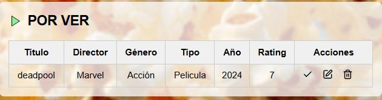
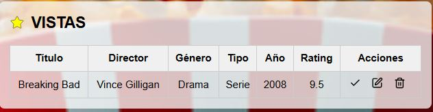
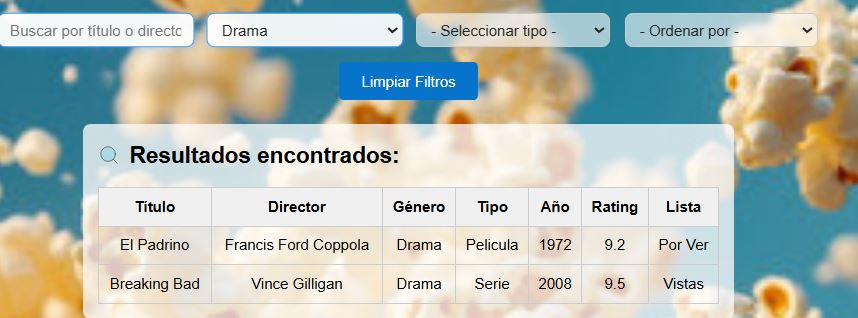

* Item

Componente que muestra los detalles de cada pelicula/serie, junto con las opciones de editar, cambiar de estado y eliminar.

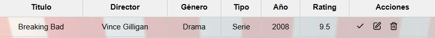

* Form

Componente que muestra un formulario para agergar un nuevo item.

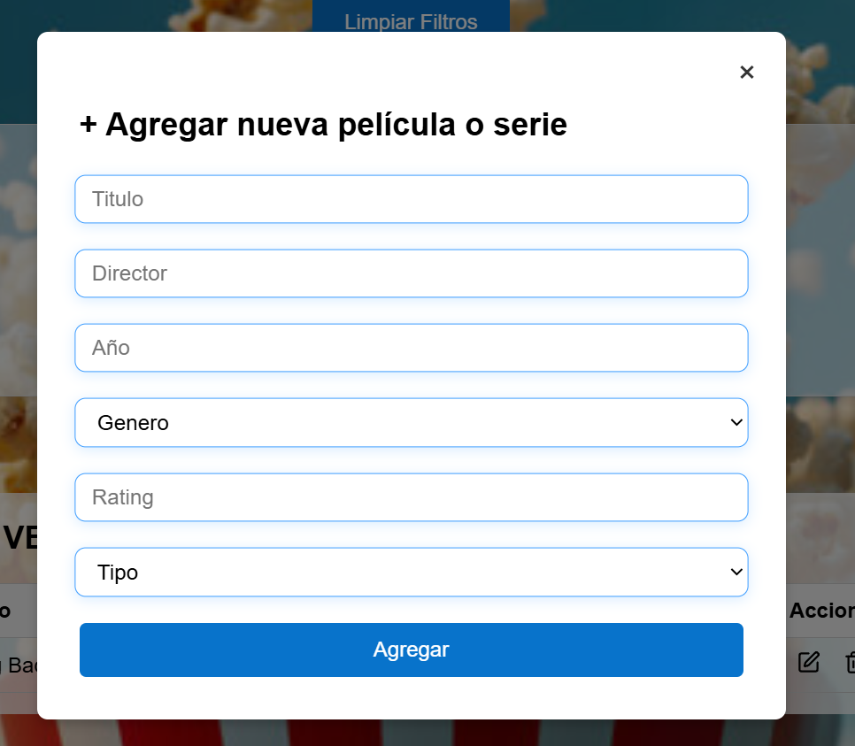

* Input

Componente de entrada de texto o numerico que es utilizado en las opciones de editar un item y agregar un item. Además cuenta con un mensaje de error personalizado.

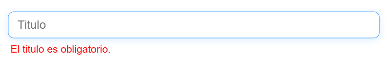

* Select

Componente de tipo select que es utilizado en la opción de editar un item y agregar un item. Además cuenta con un mensaje de error personalizado.

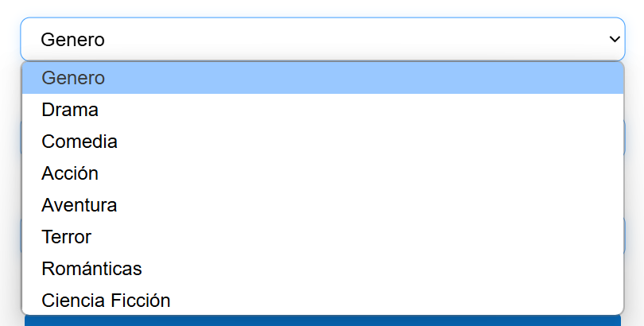
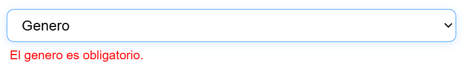

* Title

Componente que renderiza un texto, utilizado como titulo principal de la página.

